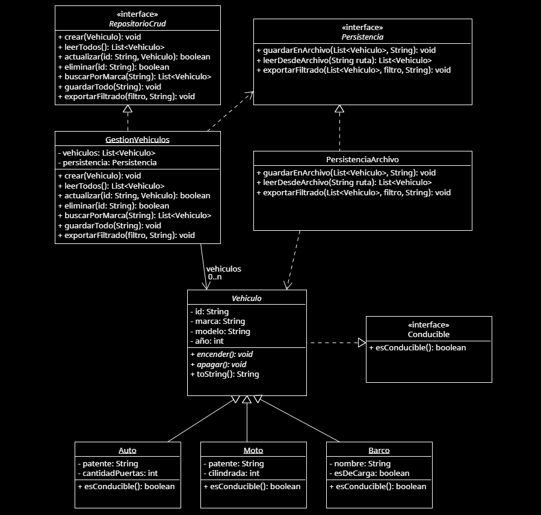

# Sistema de Gestión de Vehículos – Final Programación II

Este proyecto implementa un sistema en Java orientado a objetos para gestionar vehículos. Fue desarrollado como parte del **examen final de Programación II**, División 323.

---

## Indice

- [Características](#características)
- [Tecnologías usadas](#tecnologías-usadas)
- [Estructura del proyecto](#estructura-del-proyecto)
- [Modelado UML](#modelado-uml)
- [Ejemplo de funcionamiento](#ejemplo-de-funcionamiento)
- [Persistencia en TXT](#persistencia-en-txt)
- [Cómo ejecutar](#cómo-ejecutar-el-proyecto)
- [Capturas](#capturas)

---

## Características

- Gestión de entidades con herencia  
- CRUD completo sobre vehículos  
- Interfaz genérica para repositorio  
- Persistencia en archivos `.txt` legibles  
- Exportación filtrada a archivos  

---

## Tecnologías usadas

- Java con Ant
- Serialización manual vía texto (`.txt`)

---

## Estructura del proyecto

```
/finalProgramacionII
│───/src
│     └─── Main.java
│     └─── Vehiculo.java (abstracta)
│     └─── Auto.java
│     └─── Moto.java
│     └─── Barco.java
│     └─── Conducible.java
│     └─── RepositorioCrud.java
│     └─── GestionVehiculos.java
│     └─── Persistencia.java
│     └─── PersistenciaArchivo.java
└───/data
      └─── vehiculos.txt
      └─── vehiculos_filtrados.txt
/imagenes
   └─── archivo_exportacion_filtrado.png
   └─── archivo_lectura_escritura.png
   └─── ejemplo_ejecucion.png
   └─── uml_gestion_vehiculos.png
README.md
uml_gestion_vehiculos.uxf
```

---

## Modelado UML (resumen)

- `Vehiculo` (abstracta) → subclases: `Auto`, `Moto`, `Barco`
- `Conducible` → interfaz implementada por vehículos manejables
- `RepositorioCrud<T>` → interfaz genérica para operaciones CRUD
- `GestionVehiculos` → clase que implementa el CRUD
- `Persistencia` → interfaz para guardar y cargar archivos
- `PersistenciaArchivo` → implementación concreta en `.txt`

---

## Ejemplo de funcionamiento

```java
// Crear persistencia y gestor
Persistencia persistencia = new PersistenciaArchivo();
GestionVehiculos sistema = new GestionVehiculos(persistencia);

// Crear vehiculos
sistema.crear(new Auto("A1", "Toyota", "Corolla", 2020, "ABC123", 4));
sistema.crear(new Moto("M1", "Yamaha", "R3", 2021, "XYZ789", 300));

// Todos los vehiculos
sistema.leerTodos();

// Realizar la busqueda por marca de vehiculo
sistema.buscarPorMarca("Toyota");

// Actualiza un vehiculo, sin dejar que se duplique el id si se modifica
Vehiculo nuevoVehiculo = new Auto("A2", "Toyota", "Yaris", 2024, "XYZ787", 4);        
sistema.actualizar("A1", nuevoVehiculo);

// Elimina un vehiculo si encuentra el id
sistema.eliminar("A2");

// Exportar todos los vehículos a un txt
sistema.guardarEnArchivo(sistema.leerTodos(), "data/vehiculos.txt");

// Exportar solo los que son instancias de AUTO a un txt filtrando con el test del Predicate
Predicate<Vehiculo> filtroAutos = v -> v instanceof Auto;
persistencia.exportarFiltrado(sistema.leerTodos(), filtroAutos, "data/vehiculos.txt");

```

---

## Persistencia en TXT

- Los datos se guardan como líneas de texto separadas por ;
- Formato por tipo:

```txt
Auto;A1;Toyota;Corolla;2020;ABC123;4
Moto;M1;Yamaha;R3;2021;XYZ789;300
Barco;B1;Yamaha;WaveRunner;2019;Poseidón;false
```
- Lectura y escritura se hacen con BufferedReader y PrintWriter
- Exportación filtrada con Predicate<Vehiculo> y stream().filter()

---

## Cómo ejecutar el proyecto
1 - Abrir el proyecto

2 - Asegurarse de tener creada la carpeta /data en la raíz

3 - Ejecutar el archivo Main.java

4 - Ver los resultados en consola y archivos .txt generados

---

## Capturas



---

## Autor

- Joaquin Cortés
- Legajo - 116257

- Programación II - 2C 2024
- Profesor: Marcelo Espinosa

Año 2025
